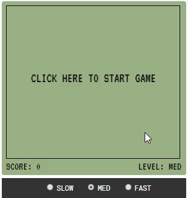

# Retro Snake Game

You can see it in action [here](https://robkramer.dev/snake_game/)

The snake game is a simple game created in html (using canvas) and javascript. The objective is to guide the snake to the apples using the arrow keys on your keyboard. Each apple the snake 'eats' adds 1 point to the score and adds to the size of the snake.  

The game ends if the snake hits the edge of the board or runs into itself.

## Getting Started

Use the 'Download ZIP' option to copy the repo to your computer. Once downloaded, unzip the folder. 

Open the folder and select/run index.html

Have fun!

## Authors

[Rob Kramer](https://github.com/rahbuh)

